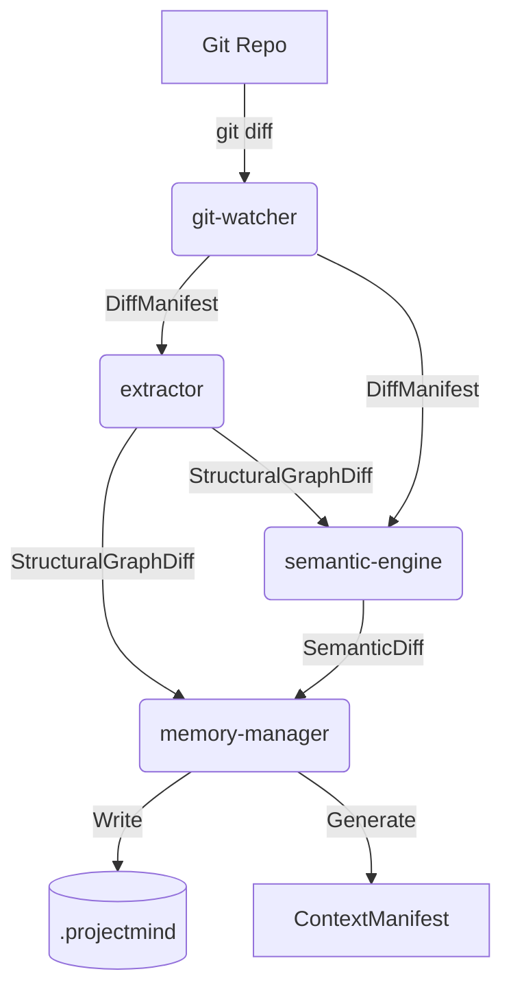

# Data Flow Specification

This document details the precise data structures and schemas that flow between the internal modules of ProjectMind. By defining strict contracts, we ensure deterministic behavior and decouple the layers.

## 1. Flow Diagram



## 2. Data Contracts

### 2.1 DiffManifest (JSON)
* **Origin:** `git-watcher`
* **Destination:** `extractor`, `semantic-engine`
* **Purpose:** Represents the physical file changes.
* **Schema:**
```json
{
  "commit_hash_from": "string",
  "commit_hash_to": "string",
  "files": [
    {
      "path": "string",
      "status": "added | modified | deleted",
      "raw_diff": "string (unified diff chunk)"
    }
  ]
}
```

### 2.2 StructuralGraphDiff (JSON)
* **Origin:** `extractor`
* **Destination:** `semantic-engine`, `memory-manager`
* **Purpose:** Represents the abstract syntactic changes (nodes and edges added/removed).
* **Schema:**
```json
{
  "nodes_added": [
    {"id": "func:auth.login", "type": "function", "file": "auth.ts", "metadata": {"signatures": "..."}}
  ],
  "nodes_removed": [
    {"id": "func:auth.oldLogin"}
  ],
  "edges_added": [
    {"source": "func:app.main", "target": "func:auth.login", "type": "calls"}
  ],
  "edges_removed": []
}
```

### 2.3 SemanticDiff (JSON)
* **Origin:** `semantic-engine`
* **Destination:** `memory-manager`
* **Purpose:** Represents the LLM-derived understanding of the changes.
* **Schema:**
```json
{
  "intent_summary": "Migrated legacy login function to a new JWT-based authentication flow.",
  "architectural_impact": "Medium: Replaced session cookies with JWT in the auth module.",
  "tasks_completed": ["TICK-102"],
  "design_decisions_logged": [
    {
      "topic": "Authentication",
      "decision": "Use JWT instead of Sessions for scalability."
    }
  ]
}
```

### 2.4 ContextManifest (Markdown)
* **Origin:** `memory-manager` via `context-generator`
* **Destination:** Standard Output (read by external AI Coding Agents)
* **Purpose:** The final, highly compressed markdown file that AI agents read when connecting to the repo.
* **Structure:**
  * **System Architecture:** High-level summary of domains.
  * **Recent Decisions:** Top 5 recent design decisions.
  * **Current State:** Active tasks or broken builds.
  * **Component Index:** List of major components and their purpose.

## 3. Immutability & Validation

* Data payloads flowing between modules must be strictly validated against these schemas (e.g., using Zod or JSON Schema).
* Payloads are immutable; once emitted by a module, downstream modules may read them but not mutate them.

---

### Definition of Done Checklist
- [x] Functional Done: Traces data flow through the architecture.
- [x] Architectural Done: Explicitly defines JSON schemas for intermediate payloads.
- [x] AI-Ready Done: Schemas are clear, unambiguous, and ready for code generation.
