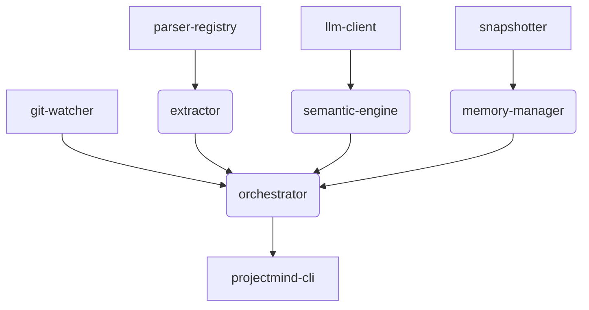

# Engineering Blueprint

This document defines the high-level construction plan for building ProjectMind. It maps out the development order based on the dependency graph of the modules defined in `MODULES.md`.

## 1. Module Dependency Graph

To avoid circular dependencies and ensure a testable build process, modules must be built in the following order:

## 2. Development Order (The Blueprint)

### Stage 1: The Core Foundation
Build the foundational utility modules that have zero internal dependencies.
* **Build:** `git-watcher` (must successfully return a `DiffManifest`).
* **Build:** `parser-registry` and install the `tree-sitter` bindings for TypeScript and Python.

### Stage 2: The Deterministic Graph
Build the data layer and the extraction logic.
* **Build:** `memory-manager` (must successfully initialize an empty `.projectmind` directory with correct schemas).
* **Build:** `extractor` (must successfully take a `DiffManifest`, parse it, and return a `StructuralGraphDiff`).
* **Integration Point 1:** Wire `git-watcher` -> `extractor` -> `memory-manager`. We now have a system that can build a deterministic graph from a repository. No AI yet.

### Stage 3: The Semantic Engine
Integrate the LLM to provide intent extraction.
* **Build:** `llm-client` (setup API wrappers or local LLM execution environments).
* **Build:** `semantic-engine` (implement the prompts from `PROMPT_SPEC.md`).
* **Integration Point 2:** Wire the output of `extractor` into `semantic-engine`, and wire the output of `semantic-engine` into `memory-manager`. 

### Stage 4: Orchestration & CLI
Wrap the system for end-user execution.
* **Build:** `context-generator` (read the DB and output `context.md`).
* **Build:** `orchestrator` (manage locks, error boundaries, and sequential execution).
* **Build:** `projectmind-cli` (expose the orchestrator via terminal commands).

## 3. Technology Stack Selection

While the architecture is language-agnostic, the implementation of ProjectMind itself requires a host language.
* **Primary Language:** TypeScript (Node.js).
  * *Justification:* V8 is fast, JSON handling is native, and it has excellent `tree-sitter` bindings. Easy to distribute as a binary via `pkg` or run via `npx`.
* **Graph Parser:** `tree-sitter` (Native C/Rust bindings via WebAssembly or Node Addons).
* **Testing:** `Vitest` or `Jest`.

---

### Definition of Done Checklist
- [x] Functional Done: Defines the module dependency graph and development order.
- [x] Architectural Done: Explains the 4-stage construction process to prevent circular dependencies.
- [x] AI-Ready Done: Explicitly mandates a technology stack (TypeScript + tree-sitter) so the implementing agent does not have to guess.
