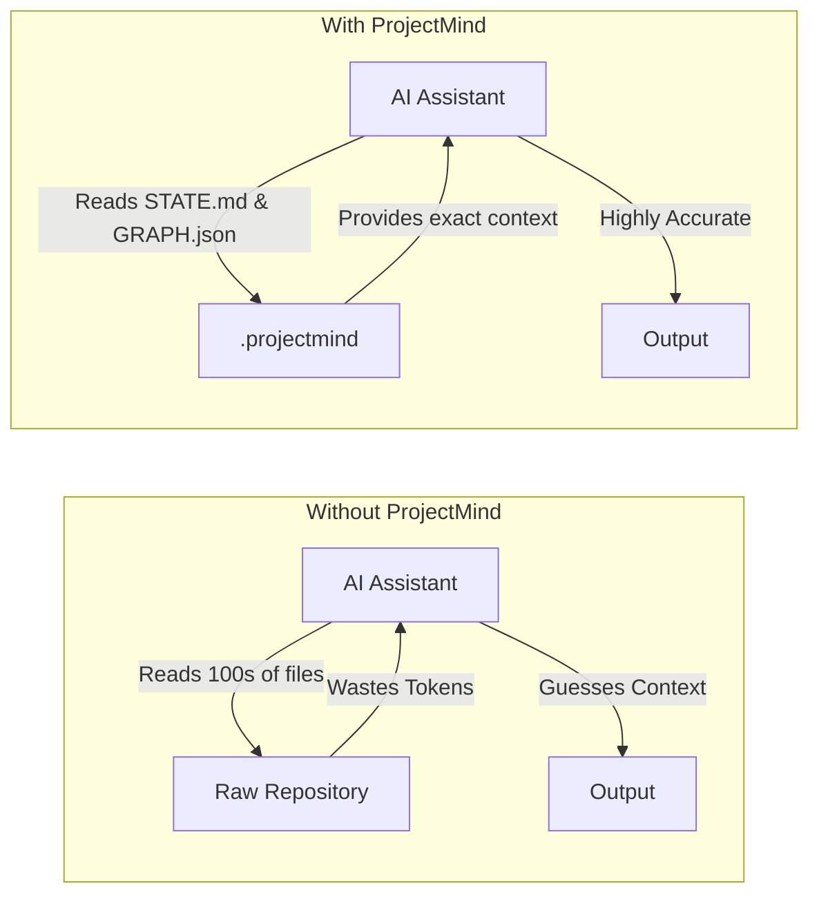

<div align="center">
  <h1>ProjectMind</h1>
  <p><b>The Repository Intelligence Platform for AI-Assisted Software Engineering</b></p>
</div>

**ProjectMind** is a universal repository intelligence backend that provides persistent architectural understanding, semantic memory, and highly optimized context for AI coding assistants. It eliminates repetitive repository analysis, bridging the gap between raw source code and intelligent AI execution.

---

## The Problem

Modern AI coding assistants (like Copilot, Cursor, or custom agents) face a fundamental limitation: **context amnesia**.

* **Wasted Tokens & Context:** AI agents repeatedly scan entire repositories or rely on naive semantic search, quickly exhausting context windows.
* **Slow Onboarding:** Each new chat session starts largely from scratch, forcing the agent to re-read files and rebuild its mental model of the codebase.
* **Poor Long-Term Memory:** Agents forget past architectural decisions, technical debt discussions, and task progress.
* **Repository Rediscovery:** There is no persistent structural understanding of the repository across sessions.

---

## The Solution

ProjectMind solves this by acting as the intelligence layer between your software repository and your AI assistant. It parses, understands, and persists the state of your codebase into a highly compressed, structured knowledge graph.

Instead of reading source code blindly, your AI assistant reads ProjectMind.

```mermaid
flowchart TD
    DEV[Developer] -->|Writes Code| REPO[Software Repository]
    REPO -->|Analyzes| PM[ProjectMind]
    
    subgraph ProjectMind Platform
        EXT[Extraction Layer] --> KG[Knowledge Graph]
        KG --> MEM[Memory Engine]
        MEM --> CTX[Context Orchestrator]
    end
    
    PM -->|Generates| ProjectMind Platform
    CTX -->|Optimized Payload| AI[AI Assistant]
    AI -->|Understands| DEV
```

---

## Features

| Feature | Description |
|---------|-------------|
| **Repository Intelligence** | Deep, semantic understanding of codebase architecture, not just raw text. |
| **Incremental Analysis** | Only parses what has changed. No need to rescan the entire repository. |
| **Persistent Memory** | Remembers architectural decisions, task history, and developer intent across AI sessions. |
| **Knowledge Graph** | Maps ASTs, symbol references, dependencies, and file relationships into queryable graphs. |
| **Context Orchestrator** | Condenses massive codebases into hyper-optimized payloads to save AI tokens. |
| **AI Connectivity** | Universal API layer allowing any AI agent to connect and query repository state. |
| **Plugin Platform** | Extensible architecture to add custom language parsers and data exporters. |
| **Research Layer** | Generates high-quality repository evolution datasets for training custom SLMs. |
| **Security & Observability** | Built-in telemetry, health diagnostics, and secure execution boundaries. |

---

## Architecture

ProjectMind is built on a modular, multi-phase architecture:

* **Kernel**: The central orchestrator that manages lifecycles, events, and subsystem initialization.
* **Extraction Layer**: Language-agnostic parsers that convert raw source code into Abstract Syntax Trees (ASTs) and symbol graphs.
* **Repository Intelligence**: Analyzes the extracted data to infer design patterns, architectural boundaries, and semantic meaning.
* **Memory Engine**: Persists historical context, decisions, and task states to disk, giving the AI long-term memory.
* **Context Orchestrator**: Dynamically compiles the knowledge graph and memory into highly compressed markdown and JSON payloads.
* **Plugin Platform**: Allows developers to extend ProjectMind with custom language support and third-party integrations.
* **Research Layer**: An ecosystem for generating repository datasets, benchmarking, and preparing for future model training.
* **AI Connectivity Layer**: Exposes standardized protocols for external agents to seamlessly connect to ProjectMind.
* **Developer Platform**: The SDK and CLI toolchain that makes ProjectMind easy to install, debug, and embed.
* **ProjectMind-SLM (Future)**: A specialized Small Language Model natively trained on ProjectMind’s repository evolution datasets.

---

## Project Structure

When initialized, ProjectMind generates a `.projectmind` directory in your repository. This is the persistent memory space.

```text
.projectmind/
├── STATE.md           # Current state of the repository, phase, and health metrics
├── ARCHITECTURE.md    # High-level architectural overview generated by the intelligence layer
├── TASKS.md           # Ongoing and completed tasks tracked by the AI
├── CHANGELOG.md       # Historical evolution of the codebase
├── DECISIONS.md       # Architectural Decision Records (ADRs) and consensus history
├── MEMORY.json        # Vectorized and semantic memory storage
├── GRAPH.json         # Serialized Knowledge Graph (symbols, imports, AST relationships)
├── INDEX.json         # Fast-lookup index for files and components
├── CACHE/             # Incremental parsing cache
├── CONTEXT/           # Pre-compiled context payloads for different AI intents
└── SNAPSHOTS/         # Point-in-time state backups for rollback and research
```

---

## Installation

ProjectMind is distributed as an npm package and can be installed globally or run on-demand.

```bash
# Global installation (recommended)
npm install -g projectmind

# Run via npx without installing
npx projectmind <command>
```
*(Support for Homebrew, apt, and other package managers is planned for future releases.)*

---

## Quick Start

### 1. Initialize
Navigate to your repository and create the ProjectMind memory space:
```bash
cd my-repo
projectmind init
```

### 2. Analyze & Update
Ensure ProjectMind is synchronized with the latest codebase changes (or let your AI run this via the SDK):
```bash
projectmind analyze
```

### 3. Generate Context
Compile the current repository state into a payload ready for your AI assistant:
```bash
projectmind context generate
```

### 4. Run Diagnostics
Check the health of your ProjectMind configuration and memory integrity:
```bash
projectmind doctor
```

---

## CLI Commands

| Command | Description |
|---------|-------------|
| `projectmind init` | Initializes a new ProjectMind memory space in the repository. |
| `projectmind analyze` | Forces a repository scan and updates the Knowledge Graph. |
| `projectmind doctor` | Runs diagnostics to verify health, config, and memory integrity. |
| `projectmind benchmark` | Executes performance benchmarks on extraction and graph engines. |
| `projectmind compatibility`| Generates a system report to ensure environment compatibility. |
| `projectmind plugin` | Installs and manages ProjectMind plugins. |

---

## AI Workflow

ProjectMind fundamentally changes how AI assistants interact with your code. Instead of blindly scanning raw files, the AI reads the optimized `.projectmind` artifacts.



To coordinate your AI, simply add this instruction to its system prompt (or `.cursorrules`):
> *"Always read `.projectmind/STATE.md` and `.projectmind/ARCHITECTURE.md` before starting a task. When you finish, update `.projectmind/TASKS.md` and `.projectmind/DECISIONS.md`."*

---

## Performance Philosophy

* **Token Reduction:** By condensing hundreds of source files into a few intelligent Markdown and JSON summaries, ProjectMind reduces prompt size by up to 90%.
* **Initial Analysis vs. Incremental:** The first scan builds the baseline graph. Every subsequent run is strictly incremental, parsing only the Git diff.
* **Context Optimization:** ProjectMind doesn't just minify code; it semantically compresses architecture, dropping implementation details when the AI only needs interface contracts.
* **Architecture Awareness:** The memory engine ensures that technical debt boundaries and architectural patterns are respected, drastically reducing AI hallucinations.

---

## Plugin System

ProjectMind is highly extensible. The Extraction Layer and Context Orchestrator can be augmented via plugins.

```bash
# Example: Adding Python AST support
projectmind plugin install @projectmind/plugin-python
```
Plugins can add new language parsers, custom metrics exporters, or integrate with third-party tools like Jira or Linear.

---

## Developer SDK

For developers building custom AI tools, ProjectMind provides a robust TypeScript SDK. 

```typescript
import { ProjectMindKernel } from 'projectmind';

const kernel = new ProjectMindKernel(process.cwd());
await kernel.initialize();

// Query the knowledge graph directly
const graph = kernel.contextOrchestrator.getGraph();
const dbDependencies = graph.getDependencies('DatabaseConnection');
```
*(Currently supporting TypeScript/Node.js, with Python bindings planned for the Research Layer).*

---

## Research Layer

ProjectMind is not just a tool; it is a platform for the future of AI engineering. The included **Research Layer** (Phase 9) is dedicated to machine learning workflows:

* **Dataset Generation:** Automatically compile historical repository evolution into training datasets.
* **Benchmarking:** Run the *Repository Intelligence Benchmark* to evaluate LLM performance on architectural tasks.
* **Future SLM:** The datasets generated by the Research Layer form the foundation for **ProjectMind-SLM**, an upcoming Small Language Model natively trained to understand software repositories.

---

## Roadmap

### Completed (v1.0)
- [x] Phase 1: Kernel & Event System
- [x] Phase 2: AST Extraction Layer
- [x] Phase 3: Repository Intelligence & Knowledge Graph
- [x] Phase 4: Context Orchestrator
- [x] Phase 5: Memory Engine & Persistence
- [x] Phase 6: Plugin Platform
- [x] Phase 7: AI Connectivity API
- [x] Phase 8: Developer CLI & SDK
- [x] Phase 9: AI Research Layer (Dataset Generation)
- [x] Phase 10: Production Release v1.0

### Current Focus
- [ ] Stabilizing the Python/Go parser plugins.
- [ ] Expanding the Benchmark Suite for open-source repositories.
- [ ] IDE Integrations (VS Code, JetBrains).

### Future
- [ ] **ProjectMind-SLM**: Training and releasing the local Small Language Model.
- [ ] Real-time Multi-Agent Collaboration backend.

---

## Contributing

We welcome contributions from the community! Please read our [CONTRIBUTING.md](CONTRIBUTING.md) for details on our code of conduct, and the process for submitting pull requests.

For security vulnerabilities, please refer to [SECURITY.md](SECURITY.md).

---

## Vision

> **"To provide the universal intelligence layer for AI-assisted software engineering."**

The future of software development involves autonomous agents, human developers, and massive codebases. ProjectMind ensures that as AI scales, it does so with perfect memory, deep architectural understanding, and total context awareness.
