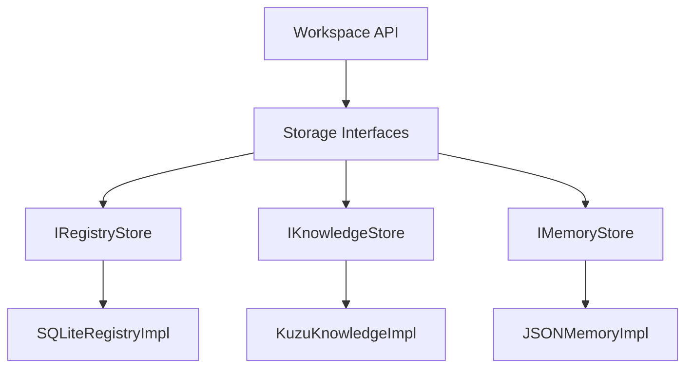

<!-- Original File: STORAGE_ARCHITECTURE.md -->

# Storage Architecture

This document outlines the multi-model storage architecture for ProjectMind v2.0. Unlike v1.0, which relied entirely on flat files (`.json`, `.jsonl`), v2.0 utilizes specialized storage engines to handle scale, speed, and complex semantic relationships.

**Crucial Constraint:** The implementation details of these storage systems must remain completely hidden behind the **Storage Abstraction Layer** (see `STORAGE_ABSTRACTION.md`).

## 1. Storage Technologies

### 1.1 SQLite (Relational / Metadata)
**Usage:** The Global Registry (`registry.db`), Workspace Configuration, and structured Memory queries.
**Justification:** 
* Zero-configuration, serverless, and portable.
* ACID compliant, protecting against corruption during unexpected shutdowns.
* Easily handles relational schemas (Repositories -> Workspaces -> Backups).
* Scales effortlessly to thousands of managed repositories.

**Registry Schema Concepts:**
* `repositories` (id, path, created_at, status)
* `workspaces` (id, repo_id, storage_path, version)
* `plugins` (id, name, version, installed_at)
* `installed_models` (id, name, type, path)
* `migrations` (id, repo_id, from_version, to_version, status)
* `backups` (id, repo_id, path, timestamp)

### 1.2 KuzuDB (Graph / Intelligence)
**Usage:** The core Knowledge Graph (AST dependencies, structural relationships).
**Justification:**
* KuzuDB is an embedded, extremely fast graph database.
* Perfect for deep, recursive traversal queries (e.g., "Find all files that depend on the `AuthenticationService` interface, up to 5 levels deep").
* Avoids the heavy memory overhead of loading flat JSON graphs into application memory during every run.

### 1.3 Vector Store (e.g., SQLite-VSS / LanceDB)
**Usage:** Storing code and documentation embeddings for semantic search.
**Justification:**
* Enables "fuzzy" natural language queries against the codebase (e.g., "Where is the password hashing logic?").
* Essential for advanced RAG (Retrieval-Augmented Generation) pipelines used by the AI agent.

### 1.4 Native Filesystem (Blobs / Manifests)
**Usage:** Final Materialized Context (`context.md`), Daemon Logs, Point-in-Time Snapshots, and caching large raw AST dumps.
**Justification:**
* AI Agents natively read markdown files much faster and with better token alignment than querying a DB.
* Logs and cache files are too ephemeral or large for structured DB storage.

## 2. Directory Layout & Subsystem Alignment

To ensure the storage architecture is future-proof, repository data is organized by **subsystem concern**, not by technology. The actual SQLite and KuzuDB files are stored opaquely in the `databases/` directory.

```text
workspaces/<repo_uuid>/
├── state/           # Serialized JSON (State Machines)
├── context/         # Markdown (Context Manifests)
├── logs/            # Plain Text (Daemon Logs)
└── databases/       
    ├── registry.db  # (SQLite) Subsystem: Registry/Memory
    ├── vector.db    # (Vector Store) Subsystem: Semantic Search
    └── graph/       # (KuzuDB) Subsystem: Knowledge Graph
```

## 3. Definition of Done Checklist

- [x] Defined every storage type: SQLite, KuzuDB, Vector, Filesystem.
- [x] Justified the use of each storage technology.
- [x] Documented the Registry SQLite tables (repositories, workspaces, plugins, migrations, etc.).
- [x] Reaffirmed that implementation details are hidden behind the Storage Abstraction Layer.


<!-- Original File: STORAGE_ABSTRACTION.md -->

# Storage Abstraction Layer

The Storage Abstraction Layer (SAL) guarantees that ProjectMind remains strictly database-agnostic. No core ProjectMind logic, including the Workspace API, is permitted to import or depend upon specific database libraries (e.g., `sqlite3`, `kuzu`, `fs`).

## 1. Architectural Philosophy



By coding exclusively against these interfaces, ProjectMind can seamlessly swap implementations (e.g., moving from KuzuDB to an external Neo4j cluster for Enterprise deployments) without modifying any business logic.

## 2. Core Storage Interfaces

### 2.1 IRegistryStore
Responsible for global metadata, mapping local paths to UUIDs, and tracking installed assets.
* **Technology Target (v2.0):** SQLite
* **Contract:**
  ```typescript
  interface IRegistryStore {
    connect(path: string): Promise<void>;
    insertRepository(repo: RepositoryRecord): Promise<void>;
    getRepositoryByPath(path: string): Promise<RepositoryRecord | null>;
    getRepositoryById(id: string): Promise<RepositoryRecord | null>;
    listAll(): Promise<RepositoryRecord[]>;
    close(): Promise<void>;
  }
  ```

### 2.2 IKnowledgeStore
Responsible for managing graph structures (AST nodes, semantic edges).
* **Technology Target (v2.0):** KuzuDB
* **Contract:**
  ```typescript
  interface IKnowledgeStore {
    connect(path: string): Promise<void>;
    upsertNodes(nodes: GraphNode[]): Promise<void>;
    upsertEdges(edges: GraphEdge[]): Promise<void>;
    deleteNodes(nodeIds: string[]): Promise<void>;
    executeTraversal(startNodeId: string, depth: number): Promise<GraphView>;
    close(): Promise<void>;
  }
  ```

### 2.3 IMemoryStore
Responsible for unstructured and time-series semantic data (e.g., conversation logs, task progress, LLM intents).
* **Technology Target (v2.0):** SQLite (JSON/Text columns) or `history.jsonl`.
* **Contract:**
  ```typescript
  interface IMemoryStore {
    connect(path: string): Promise<void>;
    appendEntry(entry: SemanticEntry): Promise<void>;
    queryEntries(range: TimeRange): Promise<SemanticEntry[]>;
    close(): Promise<void>;
  }
  ```

### 2.4 IVectorStore
Responsible for semantic search and embedding retrieval.
* **Technology Target (v2.0):** SQLite-VSS, LanceDB, or similar.
* **Contract:**
  ```typescript
  interface IVectorStore {
    connect(path: string): Promise<void>;
    upsertEmbeddings(vectors: VectorDocument[]): Promise<void>;
    similaritySearch(vector: number[], limit: number): Promise<VectorResult[]>;
    close(): Promise<void>;
  }
  ```

### 2.5 ICacheStore
Ephemeral key-value storage for high-speed retrieval of intermediate data (like raw AST dumps before graph generation).
* **Technology Target (v2.0):** In-memory (Redis-lite) or Filesystem Temp.
* **Contract:**
  ```typescript
  interface ICacheStore {
    set(key: string, value: any, ttlSeconds?: number): Promise<void>;
    get(key: string): Promise<any | null>;
    invalidate(key: string): Promise<void>;
    flush(): Promise<void>;
  }
  ```

### 2.6 IWorkspaceStore
Responsible for file-level operations within the physical workspace (creating directories, reading/writing pointer files and markdown manifests).
* **Technology Target (v2.0):** Native OS Filesystem (`fs`).
* **Contract:**
  ```typescript
  interface IWorkspaceStore {
    ensureDirectory(path: string): Promise<void>;
    writeJson<T>(path: string, data: T): Promise<void>;
    readJson<T>(path: string): Promise<T>;
    writeText(path: string, data: string): Promise<void>;
    readText(path: string): Promise<string>;
    pathExists(path: string): Promise<boolean>;
  }
  ```

## 3. Implementation Injection

The Workspace API components expect these interfaces to be injected at startup via an Inversion of Control (IoC) container or a Factory pattern. This ensures that unit tests can inject in-memory mocks without touching the disk.

## 4. Definition of Done Checklist

- [x] Defined `IRegistryStore`, `IKnowledgeStore`, `IMemoryStore`, `IVectorStore`, `ICacheStore`, `IWorkspaceStore`.
- [x] Enforced separation of concerns (no direct database imports).
- [x] Designed interfaces to be implementation-agnostic.


## Storage Core Framework
All storage systems described above are orchestrated by the [Storage Core Framework](../architecture/storage_core.md) implemented in Phase W2.1. This guarantees the abstraction layer is enforced.

## W2.3 SQLite Runtime Additions
The SQLite subsystem serves as the concrete implementation of the Relational DB block. It strictly manages metadata, memory history, registry maps, and cache via better-sqlite3.

## W2.4 Knowledge Graph Additions
The Knowledge Graph Engine implements semantic repository architecture mapping atop KuzuDB. It provides the graph models, graph builders, and traversal engines required for AI semantic search.

## W2.5 Repository Intelligence Additions
The Intelligence Engine generates the events that will ultimately be stored in the Memory SQLite DB and Knowledge Graph.

## W2.6 ProjectMind Kernel Additions
The Kernel Runtime now sits atop all systems, managing execution via events and preventing subsystems from mutating Storage directly without explicit Task scheduling.

## L2.1 Knowledge Layer Additions
The Knowledge Layer converts source code into an Intermediate ProjectMind AST using isolated language plugins via the Parser Manager.

## L2.2 Universal AST Engine
The Universal AST engine guarantees that no matter what language is parsed, ProjectMind and KuzuDB will always be populated with standardized NodeKind constructs.

## L2.3 Symbol Intelligence Engine
The Symbol Engine abstracts syntax trees into stable Semantic Identities (Symbols) that survive file location moves and establish O(1) registry indices.

## L2.4 Relationship Engine
The Relationship Engine acts as the Edge generator, transforming isolated Symbol Nodes into a massively connected semantic Graph Database, complete with explicit Evidence and lifecycle tracking.
