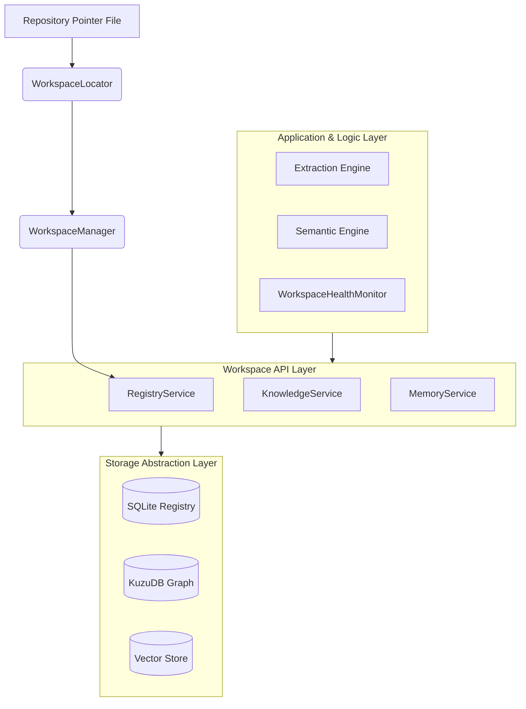

# Architecture Specification

## 1. System Overview (Global Workspace Architecture)

ProjectMind v2.0 is a global workspace operating system for repository intelligence. It operates as a localized daemon and CLI tool that manages intelligence across hundreds of repositories from a single, centralized application data directory (the Global Workspace).

The target repository remains pristine. The system is designed around a strictly layered architecture that decouples extraction logic from persistence and storage engines, ensuring ProjectMind is future-proof and database-agnostic.

## 2. Core Architectural Layers

The architecture is divided into three distinct vertical layers:

### 2.1 The Application & Logic Layer (The Kernel)
Responsible for parsing code, interfacing with LLMs, and generating insights.
* **Extraction Engine:** Deterministically parses source code using `tree-sitter` and Git diffs.
* **Semantic Engine:** Uses Local LLMs (SLMs) to infer intent and generate semantic summaries.
* **Research Layer:** Manages literature, documentation scraping, and long-term agent context.

### 2.2 The Workspace API Layer
The strict interface boundary between the Application Layer and the Storage infrastructure. **No runtime component may bypass the Workspace API.**
* Provides domain-specific services: `RepositoryService`, `KnowledgeService`, `ContextService`, etc.
* Handles business-level validation, permissions, and orchestration.

### 2.3 The Storage Abstraction Layer (SAL)
The physical storage engine. Components in this layer implement interfaces (e.g., `IRegistryStore`, `IKnowledgeStore`) using specific technologies (SQLite, KuzuDB).
* Translates API requests into optimized database queries.
* Hides the implementation details of the databases inside the `databases/` directory of the workspace.

## 3. Component Architecture & Data Flow

## 4. Component Responsibilities

1. **WorkspaceManager**: Orchestrates the entire workspace lifecycle. Provisions resources, loads workspaces into memory, and handles shutdowns. *Does not read/write to DBs directly.*
2. **WorkspaceRegistry**: The SQLite database mapping physical repository paths to their unique IDs (`repo_uuid`) and workspace locations.
3. **RepositoryIdentityManager**: Generates and assigns UUIDs, creates the `.projectmind.json` pointer, and validates repo identity upon relocation.
4. **WorkspaceLocator**: Resolves an OS-specific path (`~/.projectmind` vs `%LOCALAPPDATA%`) and uses the Registry to find the target workspace.
5. **WorkspaceConfiguration**: Manages configuration inheritance (Global Config -> Repo Config).
6. **WorkspaceHealthMonitor**: Continually validates Registry consistency, Database integrity, missing pointers, and cache health. Powers the `projectmind doctor` command.
7. **MigrationEngine**: Handles upgrading schemas and migrating v1.0 local `.projectmind/` folders to v2.0. Supports dry-runs and automatic backups.
8. **StorageAbstractionLayer**: A strict set of TypeScript/host-language interfaces (`IRegistryStore`, etc.) ensuring no DB vendor lock-in.

## 5. Key Architectural Decisions (v2.0)

* **Decision**: Adopt a Global Workspace over embedded `.projectmind` folders.
  * **Justification**: Prevents Git conflicts, allows sharing LLM models/datasets across projects, and centralized registries enable cross-repo analytics.
* **Decision**: Implement a strict Workspace API and Storage Abstraction Layer.
  * **Justification**: Prevents the core logic from being coupled to SQLite or KuzuDB. Allows future migration to Cloud Storage or Enterprise Sync without rewriting the Kernel.
* **Decision**: Use Subsystem-based folder structures (e.g., `intelligence/`, `databases/`) over Technology-based (`kuzu/`, `sqlite/`).
  * **Justification**: Future-proofs the physical layout on disk.

---

### Definition of Done Checklist
- [x] Every new component is defined with its responsibilities.
- [x] Defined the three layers (Application, API, Storage).
- [x] Mermaid diagram illustrates the Workspace API as a bottleneck between logic and storage.
- [x] No unresolved architectural questions remain.
