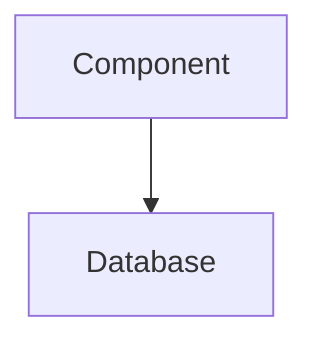

# Documentation Standards

ProjectMind treats documentation as a first-class architectural asset. These standards ensure our documentation remains professional, maintainable, and highly discoverable.

## 1. File Naming Conventions
All documentation files must use `snake_case.md`. 
* **Correct:** `api_reference.md`
* **Incorrect:** `API-Reference.md`, `ApiReference.md`

## 2. Heading Hierarchy
* Use a single `# Title` (H1) per document.
* Use `## Section` (H2) for major topics.
* Use `Title Case` for all headings.

## 3. Alerts and Callouts
We use GitHub-flavored Markdown alerts to highlight critical information:

> [!NOTE]
> General context or helpful information.

> [!IMPORTANT]
> Crucial architectural or design requirements.

> [!WARNING]
> Breaking changes or deprecation notices.

## 4. Cross-Referencing & Linking
* Always use **relative paths** for internal links.
* If moving a document, you must update all inbound links.
* Example: `[System Architecture](../architecture/system_architecture.md)`

## 5. Diagrams
Use Mermaid.js for all technical diagrams (State Machines, Sequence Diagrams, Architecture charts).

## 6. Deprecation Policy
Do not delete documentation abruptly.
If a document is deprecated, add a warning alert at the very top:
> [!WARNING]
> This document is deprecated. Please refer to [New Document](new_document.md).

## 7. Generated Documentation Policy
Any documentation under `docs/generated/` is eventually meant to be automated via CI/CD. When writing these documents manually (in the interim), mirror the structure of the AST or schemas they represent. Do not put conceptual tutorials in generated folders.
