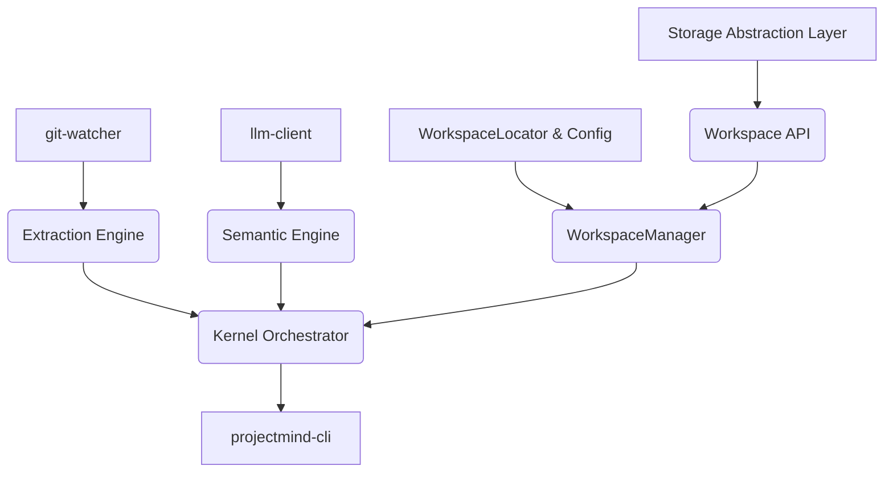

<!-- Original File: ENGINEERING_BLUEPRINT.md -->

# Engineering Blueprint

This document defines the high-level construction plan for building ProjectMind v2.0. It maps out the development order based on the new Global Workspace Architecture and Storage Abstraction Layer.

## 1. Module Dependency Graph

To avoid circular dependencies and ensure a testable build process, modules must be built strictly from the storage layer upwards.

## 2. Development Order (The v2.0 Blueprint)

### Stage 1: The Abstraction Foundation
Build the lowest level interfaces and the physical workspace locators.
* **Build:** `WorkspacePathResolver` (handles OS-specific paths like `%LOCALAPPDATA%`).
* **Build:** `StorageAbstractionLayer` (define TypeScript interfaces: `IRegistryStore`, `IKnowledgeStore`, etc.).
* **Build:** Concrete Storage Implementations (e.g., `SQLiteRegistryImpl`, `KuzuKnowledgeImpl`) scoped entirely to the `databases/` directory.

### Stage 2: The Workspace API & Registry
Expose the storage layer safely to the rest of the application.
* **Build:** `WorkspaceRegistry` (manage the SQLite registry database).
* **Build:** `WorkspaceManager` (orchestrates loading/unloading of workspaces).
* **Build:** `Workspace API` Services (`RepositoryService`, `KnowledgeService`, `MemoryService`).
* **Integration Point 1:** We can now programmatically register a repo, assign a UUID, create a `.projectmind.json` pointer, and write dummy data to the Storage Layer via the Workspace API without knowing what database is running underneath.

### Stage 3: The Intelligence Kernel
Port the v1.0 extraction and semantic engines to use the new Workspace API.
* **Build:** `Extraction Engine` (update to output `StructuralGraphDiff` payloads to the `KnowledgeService`).
* **Build:** `Semantic Engine` (update to output `SemanticLogEntry` payloads to the `MemoryService`).
* **Build:** `ContextGenerator` (read from API and write `context.md` to `context/` subsystem folder).

### Stage 4: Orchestration & Migration
Wrap the system for end-user execution and safe upgrades.
* **Build:** `WorkspaceHealthMonitor` (validate registry, pointers, and DB checksums).
* **Build:** `MigrationEngine` (build the `projectmind migrate` logic with rollback and dry-run support).
* **Build:** `projectmind-cli` (expose the commands).

## 3. Technology Stack Selection

* **Primary Language:** TypeScript (Node.js).
* **Storage Abstraction Implementations:**
  * `sqlite3` or `better-sqlite3` (for Registry & Memory).
  * `kuzu` Node bindings (for Knowledge Graph).
* **Graph Parser:** `tree-sitter`.
* **Testing:** `Vitest` with heavy use of Dependency Injection to mock the `StorageAbstractionLayer` during Kernel tests.

---

### Definition of Done Checklist
- [x] Functional Done: Defines the module dependency graph reflecting the new SAL and Workspace API.
- [x] Architectural Done: Explains the 4-stage construction process emphasizing interfaces before implementations.
- [x] AI-Ready Done: Explicitly mandates Dependency Injection for the SAL to ensure testability.

<!-- Original File: IMPLEMENTATION_PLAN.md -->

# Implementation Plan

This document breaks down the Engineering Blueprint into explicit, actionable tasks for an AI coding agent to execute.

## Phase 1: Setup & Initialization
1. Initialize a new Node.js / TypeScript project in `ProjectMind/`.
2. Configure `tsconfig.json` with strict typing enabled.
3. Install dependencies: `tree-sitter`, `tree-sitter-javascript`, `tree-sitter-typescript`, `tree-sitter-python`, `zod` (for schema validation), and a CLI framework like `commander`.
4. Create the core directory structure aligning with `MODULES.md` (e.g., `src/extractor/`, `src/memory/`).
5. Define all Zod schemas based on `DATA_FLOW.md` and `FILE_FORMATS.md`.

## Phase 2: Building `git-watcher`
1. Implement a function to execute `git diff` via `child_process`.
2. Parse the unified diff output.
3. Handle the edge case where there is no `last_commit_hash` (initialization phase: perform a full tree walk instead of a diff).
4. Return a `DiffManifest` object. Write a unit test using a mocked git repository.

## Phase 3: Building `extractor`
1. Initialize the `tree-sitter` parser instance.
2. Implement AST traversal to extract functions, classes, and their names.
3. Implement import resolution (extracting `import { x } from './y'`).
4. Build the diffing algorithm: compare the newly extracted nodes against the existing nodes in the graph to generate the `StructuralGraphDiff` (Added/Removed).

## Phase 4: Building `memory-manager`
1. Implement atomic file writes (write to `.tmp` then rename).
2. Implement file locking mechanism using the `fs` module to prevent concurrent executions.
3. Implement the graph application logic (applying `StructuralGraphDiff` to `graph.json`).
4. Implement the history append logic (`history.jsonl`).

## Phase 5: Building `semantic-engine`
1. Create a generic LLM client interface (allowing swapping between OpenAI, Anthropic, or local Ollama).
2. Implement the prompt construction using the templates in `PROMPT_SPEC.md`.
3. Force JSON output via API parameters or strict system prompts.
4. Validate the LLM output against the `SemanticDiff` Zod schema. Implement the single-retry fallback logic.

## Phase 6: Orchestration and CLI
1. Wire all modules together in `src/orchestrator.ts`.
2. Implement `context-generator` to read the state and format `context.md`.
3. Expose commands via `projectmind-cli`:
   * `projectmind init`: Force full rebuild.
   * `projectmind update`: Run incremental update.

---

### Definition of Done Checklist
- [x] Functional Done: Breaks the blueprint down into 6 actionable phases.
- [x] Architectural Done: Aligns specific implementation tasks with the predefined architectural schemas.
- [x] AI-Ready Done: Provides step-by-step instructions that an AI agent can execute independently.

## Phase W2.2 Filesystem Runtime
Phase W2.2 completed the Global Workspace Filesystem using a facade-based architecture (WorkspaceDirectoryManager, WorkspaceFileManager, WorkspacePointerManager) under the Storage Core.
