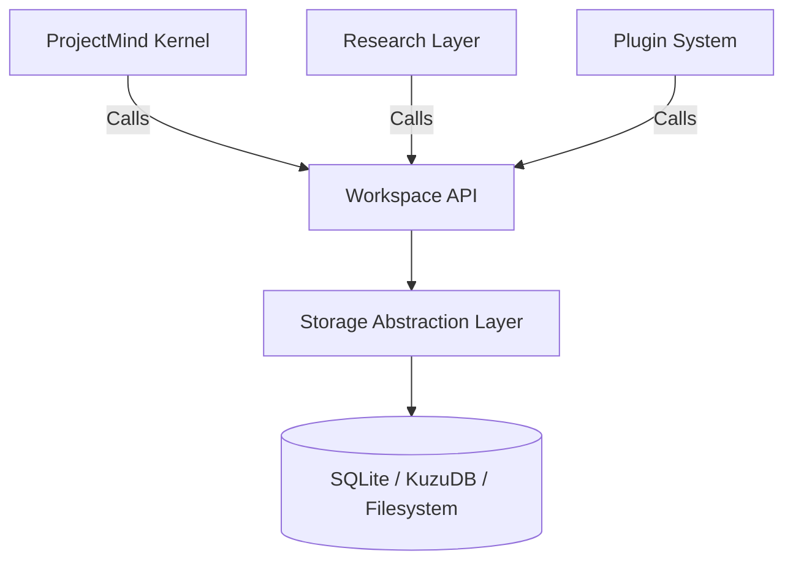

# Workspace API Specification

This document defines the core contract between the ProjectMind runtime (Kernel, Research Layer, etc.) and the underlying Storage & Workspace infrastructure. 

**Rule:** No subsystem may access the filesystem, SQLite, KuzuDB, or any other storage implementation directly. All access must be routed through the Workspace API.

## 1. Architectural Role



By enforcing this API, we allow future transitions to Cloud Synchronization or Enterprise Storage without altering any business logic in the Kernel.

## 2. API Versioning Strategy

The API is versioned at the root level using semantic versioning. 
* Current Version: `v2.0`
* A change in major version indicates breaking changes in the Input/Output schemas.
* Minor versions add backwards-compatible methods or fields.

## 3. Core Services

The Workspace API is subdivided into domain-specific Services.

### 3.1 RegistryService
Manages global registration of repositories, models, and plugins.

**Methods:**
* `registerRepository(path: string): Promise<RepositoryIdentity>`
  * **Input:** Absolute path to a local repository.
  * **Output:** A globally unique UUID and metadata.
* `resolveWorkspace(repositoryId: string): Promise<WorkspaceInfo>`
  * **Input:** Repository UUID.
  * **Output:** Resolved paths and status of the global workspace.
* `listRepositories(): Promise<RepositoryIdentity[]>`

### 3.2 RepositoryService
Manages the lifecycle and state of a specific repository workspace.

**Methods:**
* `initialize(repositoryId: string): Promise<void>`
  * Sets up the `databases/`, `state/`, and `metadata/` structure.
* `archive(repositoryId: string): Promise<ArchiveToken>`
* `delete(repositoryId: string): Promise<void>`

### 3.3 KnowledgeService
Manages the structural and semantic dependency graphs (ASTs and logic maps).

**Methods:**
* `updateGraph(repositoryId: string, diff: StructuralGraphDiff): Promise<UpdateResult>`
  * **Input:** A deterministic set of added/removed nodes and edges.
  * **Output:** Success boolean and performance metrics.
* `queryDependencies(repositoryId: string, nodeId: string, depth: number): Promise<GraphNode[]>`
* `findReferences(repositoryId: string, symbol: string): Promise<GraphNode[]>`

### 3.4 ContextService
Manages the Materialized Views and human/AI-readable context manifests.

**Methods:**
* `writeContext(repositoryId: string, manifest: ContextManifest): Promise<void>`
  * **Input:** The AI-ready Markdown representation of the repository.
* `readContext(repositoryId: string): Promise<ContextManifest>`

### 3.5 MemoryService
Handles semantic intent, long-term tracking, and historical logs.

**Methods:**
* `appendLog(repositoryId: string, entry: SemanticLogEntry): Promise<void>`
  * **Input:** LLM-generated summaries and task progress.
* `queryHistory(repositoryId: string, timerange: TimeRange): Promise<SemanticLogEntry[]>`

### 3.6 HealthService
Validates the structural integrity of the workspace and databases.

**Methods:**
* `checkHealth(repositoryId: string): Promise<HealthReport>`
  * **Output:** A `HealthReport` containing status codes for Registry consistency, Database integrity, Pointer files, and Storage corruption.
* `repair(repositoryId: string): Promise<RepairResult>`
  * Attempts automated recovery for broken pointer files or corrupt indexes.

## 4. Input / Output Contracts

All payloads must be strongly typed and serializable (e.g., JSON Schema / Zod).

**Example: `HealthReport` Contract**
```json
{
  "status": "healthy | degraded | corrupted",
  "checks": {
    "registryConsistency": true,
    "pointerFileValid": true,
    "databaseIntegrity": false,
    "cacheHealth": true
  },
  "errors": [
    {
      "code": "ERR_DB_CORRUPT",
      "message": "SQLite checksum failed in databases/registry.db",
      "severity": "critical"
    }
  ]
}
```

## 5. Error Handling

The Workspace API uses a standardized `WorkspaceError` class.
* **`ERR_NOT_FOUND`**: Repository UUID or specific entity does not exist.
* **`ERR_LOCKED`**: Concurrency lock prevents the operation.
* **`ERR_CORRUPT`**: Storage level failure requiring repair.
* **`ERR_STORAGE_UNAVAILABLE`**: Disconnected drive or permissions issue.

No underlying database errors (e.g., `SQLITE_BUSY` or KuzuDB specific exceptions) should leak through the API. They must be caught, logged in `logs/`, and translated into a `WorkspaceError`.

## 6. Definition of Done Checklist

- [x] Defined all requested services: Repository, Memory, Context, Knowledge, Registry, Health.
- [x] Documented public methods and I/O contracts.
- [x] Documented versioning strategy.
- [x] Detailed error handling and error translation rules.
