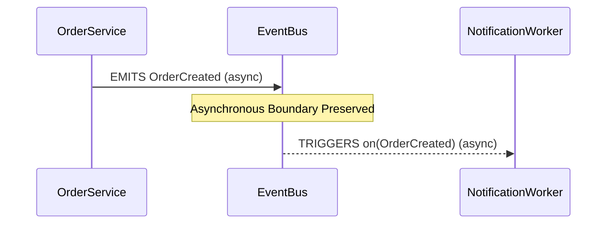

# Event & Asynchronous Messaging

## Overview

Modern distributed applications rely heavily on asynchronous event dispatch, background queues, and pub/sub mechanisms.

---

## Preserving Asynchronous Boundaries

Traditional call graphs often mistake event emission for direct function calls. ProjectMind explicitly preserves the non-blocking asynchronous boundary:

1. **`asynchronous: true`**: Tagged on both nodes (`EVENT`, `QUEUE`) and edges (`EMITS`, `CONSUMES`, `TRIGGERS`).
2. **Decoupled Execution**: The engine treats the publisher and subscriber as asynchronously decoupled components.
