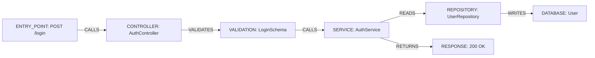

# Model: FeatureFlow, FeatureFlowNode & FeatureFlowEdge

## Overview

A `FeatureFlow` represents a directed, ordered execution path through a set of technical resources that collaborate to achieve a functional objective.



---

## Data Models

### 1. `FeatureFlowNode`

```typescript
export interface FeatureFlowNode {
  nodeId: string;
  resourceId: string;
  resourceType: MappingResourceType;
  stepType: FeatureFlowStep;
  label: string;
  metadata: FeatureFlowNodeMetadata;
  confidence: number;
}
```

- **`stepType`**: Categorizes the architectural role in the flow (e.g. `ENTRY_POINT`, `CONTROLLER`, `SERVICE`, `REPOSITORY`, `DATABASE`, `EVENT`, `EXTERNAL_SERVICE`).
- **`metadata.featureBoundary`**: Set to `true` when step crosses into another feature.
- **`metadata.targetFeatureId`**: The ID of the target feature crossed into.
- **`metadata.asynchronous`**: Flag preserved for message queues and decoupled event subscribers.

### 2. `FeatureFlowEdge`

```typescript
export interface FeatureFlowEdge {
  edgeId: string;
  sourceNodeId: string;
  targetNodeId: string;
  relationType: FeatureFlowRelationType;
  condition?: string;
  asynchronous: boolean;
  confidence: number;
  evidence: FeatureBehaviorEvidence[];
  metadata?: Record<string, any>;
}
```

- **`relationType`**: Semantic transition (`CALLS`, `READS`, `WRITES`, `VALIDATES`, `AUTHORIZES`, `TRANSFORMS`, `EMITS`, `CONSUMES`, `AWAIT`, `RETURNS`, `FAILS_TO`, `REDIRECTS_TO`, `TRIGGERS`).
- **`condition`**: Branch predicate (e.g. `'condition == true'`, `'error != null'`).
- **`asynchronous`**: `true` for non-blocking queue hops or event broadcasts.

### 3. `FeatureFlow`

```typescript
export interface FeatureFlow {
  flowId: string;
  featureId: FeatureId;
  name: string;
  description?: string;
  flowType: FeatureFlowType;
  direction: FeatureFlowDirection;
  nodes: FeatureFlowNode[];
  edges: FeatureFlowEdge[];
  entryNodeId?: string;
  exitNodeIds: string[];
  confidence: number;
  evidence: FeatureBehaviorEvidence[];
  createdAt: number;
  updatedAt: number;
}
```
