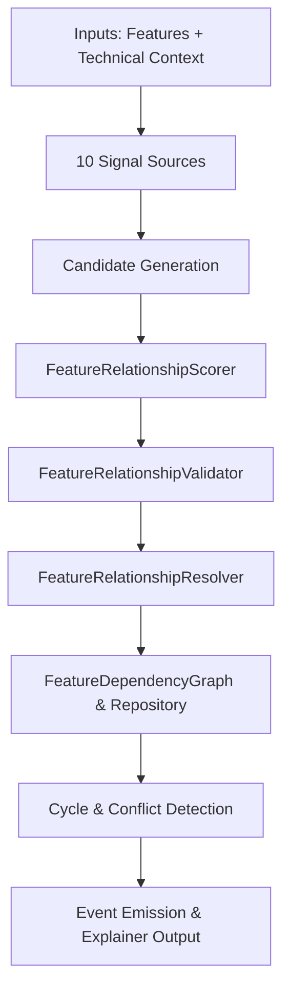

# Architecture: Feature Dependency Graph

## Architectural Context

The Feature Dependency Graph operates as the relationship projection layer in ProjectMind's knowledge system:

```
┌─────────────────────────────────────────────────────────────┐
│                    Layer 2: Features                         │
│                                                             │
│   Phase 6.1: Feature Model & Identity                       │
│   Phase 6.2: Feature Discovery Engine                       │
│   Phase 6.3: Feature-to-Code Mapping Engine                 │
│                                                             │
│   Phase 6.4: Feature Dependency Graph ◄── [THIS ENGINE]     │
│   ┌─────────────────────────────────────────────────────┐   │
│   │ Feature A ──[DEPENDS_ON / CONSUMES]──► Feature B   │   │
│   │ Feature B ◄──[SHARES_RESOURCE / DATA]─► Feature C   │   │
│   │ Cycle Detection (Tarjan / DFS) + Risk Alerts        │   │
│   └─────────────────────────────────────────────────────┘   │
└──────────────────────────────▲──────────────────────────────┘
                               │ Projects
┌──────────────────────────────┴──────────────────────────────┐
│                    Layer 1: Extraction                      │
│                                                             │
│   • Files & AST Symbols         • API Endpoints             │
│   • Imports & Call Graphs       • Database Entities         │
│   • Configurations              • Event Pub/Sub             │
│   • Test Suites                 • Git Commit History        │
└─────────────────────────────────────────────────────────────┘
```

---

## Processing Pipeline

The relationship discovery and resolution pipeline follows 6 strict, deterministic stages:



### 1. Signal Harvesting
Each of the 10 sources inspects relevant slices of `DependencyContext` and proposes `FeatureRelationshipCandidate` objects.
- High-level source abstractions prevent duplicate file reading or AST parsing.
- Library filtering prevents third-party packages (e.g., `lodash`, `react`, `express`) from masquerading as internal project features.

### 2. Multi-Source Scoring
`FeatureRelationshipScorer` analyzes candidates:
- Computes weighted sum using `DEFAULT_RELATIONSHIP_WEIGHTS`.
- Preserves authoritative single-source signals (e.g. endpoint route middleware $= 0.95$).
- Awards **+0.10 source diversity bonus** when corroboration exists across $\ge 2$ independent signal types.

### 3. Semantic Validation
`FeatureRelationshipValidator` validates candidate edges:
- Rejects self-dependencies ($A \to A$).
- Verifies feature existence in the `FeatureRegistry`.
- Enforces repository scope boundaries (cross-repository links must belong to consistent scopes).
- Disallows empty or zero-confidence evidence.

### 4. Conflict Resolution & Manual Protection
`FeatureRelationshipResolver` aggregates multiple candidate edges between identical feature pairs:
- Consolidates and deduplicates evidence.
- Resolves dominant relationship type based on role priority hierarchy:
  $$\text{DEPENDS\_ON} > \text{USES} > \text{CONSUMES} > \text{PROVIDES} > \dots > \text{ASSOCIATED\_WITH}$$
- Detects contradictions (e.g., `PROVIDES` vs `CONSUMES`) and circular hard dependencies, recording `FeatureDependencyConflict` records.
- **Strict Manual Protection**: Preserves manual relationships (`source: 'MANUAL'`) without type overwrite, downgrading, or deletion.

### 5. Graph Sync & Cycle Detection
- Updates in-memory `FeatureDependencyGraph` with forward and reverse adjacency indexing.
- Runs DFS cycle detection to detect elementary loops.
- Classifies cycles into `VALIDATED_CYCLE`, `SUSPECTED_CYCLE`, or `ARCHITECTURAL_RISK`.

### 6. Event Notification & Explanation
- Publishes lifecycle events (`FEATURE_RELATIONSHIP_CREATED`, `UPDATED`, `DEACTIVATED`, `CONFLICT_DETECTED`, `CYCLE_DETECTED`).
- Provides on-demand evidence explanations through `FeatureDependencyExplainer`.
